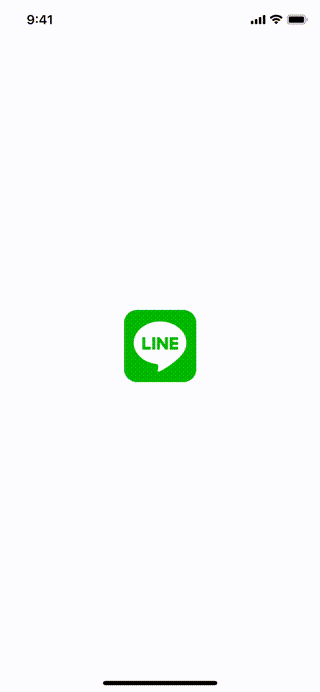

# WWSignInWith3rd+LINE

[](https://developer.apple.com/swift/) [](https://developer.apple.com/swift/)  [](https://developer.apple.com/swift/) [](https://developer.apple.com/swift/)

[Use LINE third-party login.](https://developers.line.biz)

[使用LINE的第三方登入。](https://cg2010studio.com/2020/06/20/ios-整合-line-login/)



### [Installation with Swift Package Manager](https://medium.com/彼得潘的-swift-ios-app-開發問題解答集/使用-spm-安裝第三方套件-xcode-11-新功能-2c4ffcf85b4b)
```js
dependencies: [
    .package(url: "https://github.com/William-Weng/WWSignInWith3rd_LINE.git", .upToNextMajor(from: "1.0.0"))
]
```

### Example
```swift
import UIKit
import WWSignInWith3rd_Apple
import WWSignInWith3rd_LINE

@main
final class AppDelegate: UIResponder, UIApplicationDelegate {

    var window: UIWindow?
    
    func application(_ application: UIApplication, didFinishLaunchingWithOptions launchOptions: [UIApplication.LaunchOptionsKey: Any]?) -> Bool {
        return true
    }
}

// MARK: - 相關設定
extension AppDelegate {
    
    func application(_ app: UIApplication, open url: URL, options: [UIApplication.OpenURLOptionsKey: Any] = [:]) -> Bool {
        _ = WWSignInWith3rd.LINE.shared.canOpenURL(app, open: url, options: options)
        return true
    }
    
    func application(_ application: UIApplication, continue userActivity: NSUserActivity, restorationHandler: @escaping ([UIUserActivityRestoring]?) -> Void) -> Bool {
        _ = WWSignInWith3rd.LINE.shared.canOpenUniversalLink(application, continue: userActivity, restorationHandler: restorationHandler)
        return true
    }
}
```

```swift
import UIKit
import WWPrint
import WWSignInWith3rd_Apple
import WWSignInWith3rd_LINE

final class ViewController: UIViewController {

    override func viewDidLoad() {
        super.viewDidLoad()
        initSetting()
    }
    
    /// [Line 第三方登入](https://developers.line.biz)
    @IBAction func signInWithLine(_ sender: UIButton) {
        
        WWSignInWith3rd.LINE.shared.login(presenting: self) { result in
            wwPrint(result)
        }
    }
}

// MARK: - 小工具
extension ViewController {
    
    func initSetting() {
        
        let channelId = "<channelId>"
        let channelSecret = "<channelSecret>"
        let universalLinkURL = "<universalLinkURL>"
        
        WWSignInWith3rd.LINE.shared.configure(channelId: channelId, channelSecret: channelSecret, universalLinkURL: universalLinkURL)
    }
}
```
